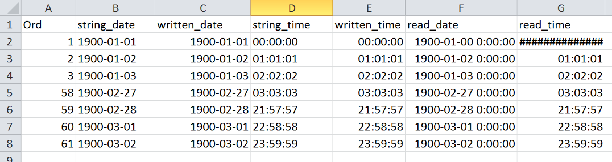
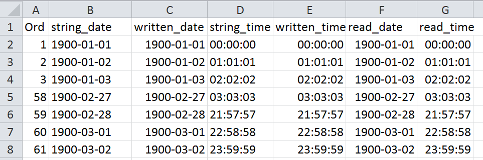
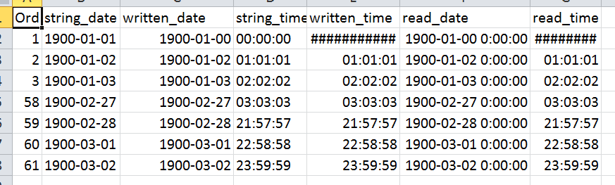

# openpyxl 2.5.0 date-handling-test

## Summary

MS Excel dates are a horrible, buggy and unpredictable mess, and
nobody who records time or date in any capacity should use
it. However, word has not gotten around yet.

The developers of the great [`openpyxl` module](https://bitbucket.org/openpyxl/openpyxl) recently introduced an improved handling of dates. A couple of test however show that this is no silver bullet. Based on the results below maybe the best advice is to not under any circumstances use a numerical data-type, including "Date" types in Excel and rather express time related stuff as strings. You can't calculate with dates then, you say? If you want to calculate anything you should not have used Excel in the first place! [:grumpy:].

## Testdata

Problems in the past have revolved around times and dates that get somewhere expressed as `0`, around Excel's counterfactual belief that 1900 was a leap year, and around the earliest allowed date (somewhere around 1900-01-01). We use a couple of test-dates and times that seem relevant in this regard, see `datetest.py` and images below. 

## Setup

+ MS Excel 2010 on Windows 7 Enterprise   
Note that differing versions of anything above, let alone using Excel for Mac, will likely change all outcomes.
+ I could not be bothered to play with different language setting of OS and Office. It is both "Swiss German", I believe.
+ openpyxl 2.4.5 and 2.5.0 (\<pyxl_version\> = 2.4.5 or 2.5.0)

## Tests

### Roundtrip

1. `datetest.py write` writes testdates into `testdates_<pyxl_version>_wr.xlsx`
2. `datetest.py read` reads the previously generated xlsx file and writes the read values back, but into new columns.

Results in `testdates_<pyxl_version>_round.xlsx`

**Roundtrip V.2.4.5**: re-written date sports Jan 0th, has funny formatting and midnight doesn't work.

 **Roundtrip V.2.5.0**: looks OK!

 
### Excel Interrupt

1. `datetest.py write` writes testdates into `testdates_<pyxl_version>_wr.xlsx`
2. Open `testdates_<pyxl_version>_wr.xlsx` with Excel and immediatel save it as `testdates_<pyxl_version>_wr_saved.xlsx`$
3. `datetest.py read` reads the previously generated xlsx file and writes the read values back, but into new columns.

Results in `testdates_<pyxl_version>_wr_saved_rew.xlsx`

**Excel Interrupt V.2.4.5**: Same botched results as Roundtrip above

**Excel Interrupt V.2.5.0**: Same botched results as above, except that now also the 1900-01-01 is changed to Jan. 0th and midnight is changed to "invalid" in the columns that were initially written correctly.

